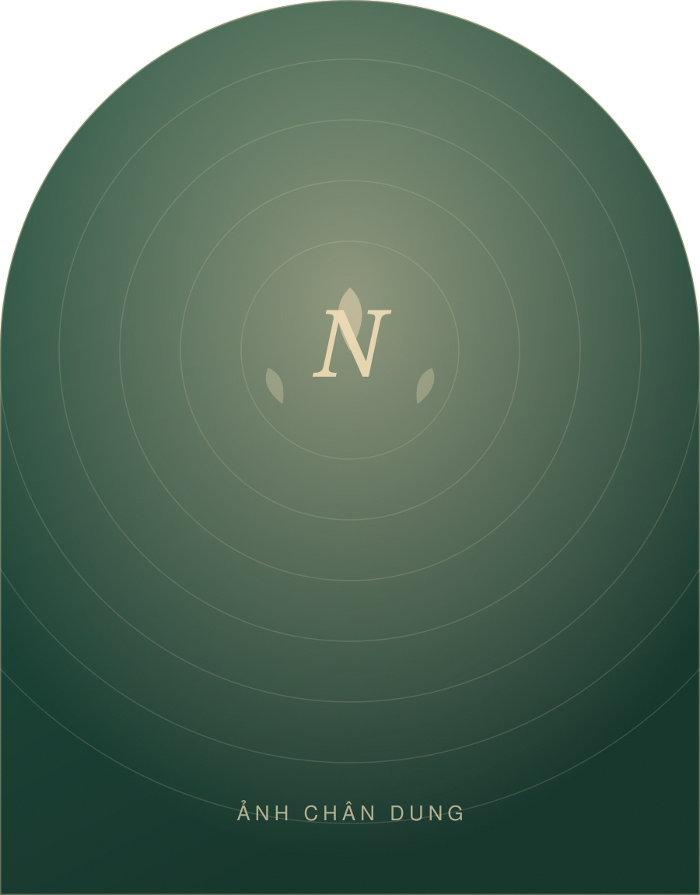

# Website Nguyễn Thị Nga — Dinh dưỡng & Sức khoẻ gia đình

Website thương hiệu cá nhân, một trang (one-page), viết bằng HTML + CSS + JavaScript thuần.
**Không cần cài đặt, không cần build, không phụ thuộc thư viện ngoài.** Mở `index.html` là chạy.

---

## 1. Chạy thử trên máy

Cách nhanh nhất — nhấn đúp vào `index.html`.

Nếu muốn giống môi trường thật (đường dẫn, font, form):

```bash
cd /Users/thnguynn/ThNguyn.Dev/Web_DinhDuong
npx http-server . -p 8899
# rồi mở http://localhost:8899
```

---

## 2. Cấu trúc thư mục

```
Web_DinhDuong/
├── index.html              ← toàn bộ nội dung chữ nằm ở đây
├── robots.txt
├── sitemap.xml
└── assets/
    ├── css/
    │   ├── styles.css      ← toàn bộ giao diện, hệ màu ở ngay đầu file
    │   └── fonts.css       ← khai báo font (không cần sửa)
    ├── js/
    │   └── main.js         ← menu, hiệu ứng, slider, form
    ├── fonts/              ← 21 file font tiếng Việt tải sẵn (261 KB)
    └── img/                ← ảnh — đây là chỗ bạn cần thay
```

---

## 3. Ý nghĩa hệ màu (phần này là điểm khác biệt của trang)

Mỗi màu được chọn để kể một phần câu chuyện, không phải chọn cho đẹp mắt:

| Màu | Mã | Ý nghĩa |
|---|---|---|
| **Ngọc bích** | `#12312A` → `#2F7357` | Sức khoẻ, sự sống, mầm cây. Màu chủ đạo — nghề dinh dưỡng và sự vững chãi. |
| **Vàng lúa** | `#A8762A` → `#EFDCB6` | Mùa gặt **sau** những năm hy sinh. Chỉ dùng làm điểm nhấn: chỗ nào có vàng, chỗ đó là thành quả. |
| **Hồng sen** | `#C97B77` | Người phụ nữ, người mẹ — sen mọc lên từ bùn. Dùng rất tiết chế, cho phần ký ức. |
| **Nâu đất** | `#2A2118` | Cội nguồn, gia đình, chữ nghĩa. Màu của chữ. |
| **Kem gạo** | `#FCF9F3` | Nền mộc mạc, ấm, không chói mắt người lớn tuổi. |

Tỉ lệ dùng: **60% kem/trắng · 25% ngọc bích · 10% nâu đất · 5% vàng + sen.**
Giữ đúng tỉ lệ này thì trang sẽ luôn sang; đổ vàng tràn lan là hỏng ngay.

Muốn đổi màu: sửa các biến trong khối `:root` ở đầu [assets/css/styles.css](assets/css/styles.css).
Đổi ở đó một chỗ là cả trang đổi theo.

---

## 4. Việc cần làm trước khi đưa lên mạng

Đây là danh sách bắt buộc. Nội dung hiện tại là **bản mẫu** dựa trên câu chuyện bạn kể.

### 4.1 Thay ảnh thật ⚠️ quan trọng nhất

Tất cả ảnh trong `assets/img/` đang là ảnh giả (SVG có chữ "Ảnh chân dung"…).
Chép ảnh thật vào thư mục đó, đặt **đúng tên file**, rồi sửa đuôi `.svg` → `.jpg` trong `index.html`:

| File cần thay | Dùng ở đâu | Kích thước nên dùng |
|---|---|---|
| `chan-dung-hero.svg` | Ảnh lớn đầu trang | 900 × 1150 (dọc) |
| `chan-dung-cau-chuyen.svg` | Mục "Câu chuyện" | 860 × 1080 (dọc) |
| `thu-vien-1…6.svg` | Thư viện ảnh | 900 × 1120 (dọc) / 900 × 700 (ngang) |
| `avatar-1…4.svg` | Ảnh người gửi cảm nhận | 160 × 160 (vuông) |
| `bai-viet-1…3.svg` | Ảnh bài viết | 800 × 520 |
| `og-image.svg` | Ảnh hiện khi chia sẻ Facebook/Zalo | 1200 × 630 |
| `favicon.svg` | Icon trên tab trình duyệt | 64 × 64 |

Ví dụ trong `index.html`:
```html
<!-- từ -->

<!-- thành -->

```

> Mẹo: nén ảnh bằng [squoosh.app](https://squoosh.app) xuống dưới 300 KB mỗi tấm,
> xuất định dạng WebP nếu được — trang sẽ mở nhanh hơn nhiều trên mạng 3G/4G.

### 4.2 Thay thông tin liên hệ

Tìm và thay trong `index.html` (dùng Ctrl+F / Cmd+F):

- `0900 000 000` → số điện thoại thật (đổi cả trong `tel:+84900000000` — bỏ số 0 đầu, thêm `+84`)
- `lienhe@ngadinhduong.com` → email thật
- `https://zalo.me/` → link Zalo thật
- `https://facebook.com/` → link Facebook thật
- `https://youtube.com/`, `https://tiktok.com/` → link thật, **hoặc xoá hẳn thẻ `<a>` đó** nếu không dùng
- `https://ngadinhduong.com/` → tên miền thật (có ở phần `<head>`, `robots.txt`, `sitemap.xml`)
- `Hà Nội` → địa phương thật

### 4.3 Thay lời cảm nhận ⚠️ bắt buộc

Bốn lời cảm nhận ở mục **Cảm nhận** là **nội dung mẫu do máy viết**, không phải người thật.
Trong `index.html` có ghi chú `<!-- LƯU Ý ... -->` ngay trên khối đó.

**Phải thay bằng cảm nhận thật và phải xin phép người viết trước khi đăng tên/ảnh họ.**
Đăng cảm nhận bịa là vi phạm quy định quảng cáo và làm mất uy tín — đúng thứ mà cả
trang này đang cố xây dựng.

Nếu chưa kịp xin, cách an toàn: **xoá tạm cả mục Cảm nhận** — xoá đoạn từ
`<section class="section testimonials" id="cam-nhan">` đến `</section>` tương ứng,
và xoá dòng `<li><a href="#cam-nhan">Cảm nhận</a></li>` trong menu.

### 4.4 Kiểm tra lại các con số

`24+ năm`, `1.200+ gia đình`, `86 buổi chia sẻ` là con số ước lượng.
Sửa trong `index.html` ở thuộc tính `data-count`:

```html
<span class="count" data-count="1200">0</span>+
```

Chỉ ghi con số bạn chứng minh được.

### 4.5 Câu chuyện & mốc thời gian

Phần "Câu chuyện" và "Hành trình" viết dựa trên những gì bạn kể (con cả, nghỉ học
cho em gái và em trai đi học). Hãy đọc lại **cùng cô Nga** và sửa cho đúng sự thật:
mốc tuổi, nghề đã làm, năm bắt đầu học dinh dưỡng, tên các em…

Chi tiết thật luôn cảm động hơn chi tiết hay.

---

## 5. Làm cho form liên hệ gửi được thật

Hiện form đang ở **chế độ xem thử**: bấm gửi chỉ hiện thông báo, không gửi đi đâu cả.

Cách nối trong 5 phút, không cần server (miễn phí):

1. Vào [formspree.io](https://formspree.io) → đăng ký → tạo form mới → lấy link dạng
   `https://formspree.io/f/xxxxxxx`
2. Mở `index.html`, tìm `<form class="form" id="contact-form" action="#"` và thay:

```html
<form class="form" id="contact-form" action="https://formspree.io/f/xxxxxxx" method="post" novalidate>
```

Xong. Mọi tin nhắn sẽ về thẳng email đã đăng ký. JavaScript đã xử lý sẵn phần gửi,
trạng thái "Đang gửi…", báo thành công và báo lỗi.

Dịch vụ tương đương: [web3forms.com](https://web3forms.com), [getform.io](https://getform.io).

---

## 6. Đưa website lên mạng

### Cách 1 — Netlify (dễ nhất, miễn phí)
1. Vào [app.netlify.com/drop](https://app.netlify.com/drop)
2. Kéo **cả thư mục `Web_DinhDuong`** thả vào trang
3. Xong — có link ngay. Muốn gắn tên miền riêng: *Site settings → Domain management*

### Cách 2 — Vercel
```bash
npx vercel --prod
```

### Cách 3 — GitHub Pages
Đẩy code lên GitHub → *Settings → Pages → Branch: main / (root)*

### Cách 4 — Hosting Việt Nam (cPanel)
Dùng File Manager, tải toàn bộ thư mục lên `public_html/`. Không cần PHP, không cần database.

---

## 7. Những gì đã có sẵn trong trang

**Nội dung** — 13 phần: Đầu trang · Câu chuyện · Hành trình (mốc thời gian) · Con số ·
Đồng hành (4 dịch vụ) · Điều tôi tin · Cảm nhận · Thư viện ảnh · Bài viết · Hỏi & Đáp ·
Liên hệ · Trích dẫn kết · Chân trang.

**Kỹ thuật**
- Font tiếng Việt tải sẵn trong máy chủ của bạn — không gọi ra Google, vào nhanh kể cả khi mạng chậm
- Chạy tốt từ điện thoại 360px đến màn hình lớn; đã kiểm tra không tràn ngang
- Menu trượt trên điện thoại, thanh tiến độ đọc, nút Zalo/gọi/lên đầu trang nổi
- Slider cảm nhận: bấm nút, vuốt tay, phím mũi tên đều được
- Xem ảnh phóng to (lightbox), đóng bằng phím Esc
- Kiểm tra form ngay khi nhập, báo lỗi bằng tiếng Việt
- Điều hướng bằng bàn phím đầy đủ, có link "Bỏ qua tới nội dung", có `aria-*`
- Tôn trọng `prefers-reduced-motion` — người bị chóng mặt sẽ không thấy hiệu ứng
- SEO: thẻ mô tả, Open Graph (Facebook/Zalo), dữ liệu có cấu trúc `Person`, `sitemap.xml`
- In ra giấy vẫn đọc được (đã có `@media print`)

**Về hiệu ứng hiện dần:** phần này cố ý **không** dùng `IntersectionObserver` mà quét
theo vị trí trong `main.js`. Lý do ghi ngay trong file — cách quét chắc chắn hơn khi
người dùng vuốt rất nhanh hoặc mở trang bằng link `#neo`.

---

## 8. Chưa có (nếu sau này cần)

- Trang blog riêng cho từng bài — hiện 3 bài ở mục "Chia sẻ" chỉ là thẻ giới thiệu,
  bấm vào chưa đi đâu. Cần thì tạo thêm `bai-viet/ten-bai.html`.
- Trang "Chính sách bảo mật" — **nên có** nếu form thu số điện thoại và bạn chạy quảng cáo Facebook.
- Đa ngôn ngữ, đặt lịch tự động, thanh toán trực tuyến.
